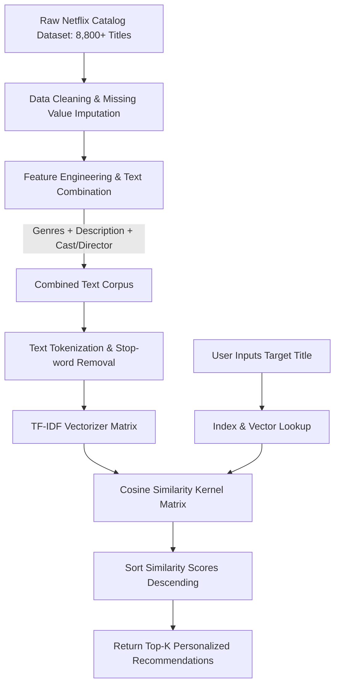

# 🎬 Netflix Movie & TV Show Recommendation System & Analytics

[](https://www.python.org/)
[](https://pandas.pydata.org/)
[](https://scikit-learn.org/)
[](https://powerbi.microsoft.com/)
[](https://jupyter.org/)

An end-to-end Content-Based Recommendation Engine and Business Intelligence Analytics project built on the Netflix catalog dataset. Combines Natural Language Processing (**TF-IDF Vectorization** & **Cosine Similarity**) with interactive visual analytics (**Power BI Dashboard** & **Matplotlib/Seaborn**) to deliver personalized movie & TV show recommendations and deep catalog insights.

---

## 🌟 Key Highlights & Features

* **🧠 Content-Based NLP Filtering**: Recommends movies and TV shows based on deep semantic similarity across genres, plot descriptions, and content categories.
* **📐 Vector Space Modeling**: Transforms unstructured text data into high-dimensional numerical vectors using **TF-IDF (Term Frequency-Inverse Document Frequency)** and computes pairwise similarity scores using **Cosine Similarity**.
* **📊 Interactive Power BI Dashboard (`.pbix`)**: Comprehensive visual business intelligence report analyzing Netflix content distribution by type (Movies vs. TV Shows), ratings, release timelines, and country production.
* **🔍 Exploratory Data Analysis (EDA)**: Statistical distributions and trend visualizations uncovering patterns across genres, durations, and content growth over time.
* **⚡ Instant Query System**: Lightweight, memory-efficient inference function retrieving the Top-N most relevant recommendations in milliseconds.

---

## 🏗️ Recommendation Engine Pipeline



---

## 📐 The Math Behind the System

### 1. TF-IDF (Term Frequency - Inverse Document Frequency)
Quantifies the importance of words in movie descriptions relative to the entire catalog:
$$\text{TF-IDF}(t, d, D) = \text{TF}(t, d) \times \log\left(\frac{|D|}{1 + |\{d \in D : t \in d\}|}\right)$$

### 2. Cosine Similarity
Calculates the angular distance between high-dimensional content vectors $A$ and $B$:
$$\text{Cosine Similarity}(\vec{A}, \vec{B}) = \frac{\vec{A} \cdot \vec{B}}{\|\vec{A}\| \|\vec{B}\|} = \frac{\sum_{i=1}^{n} A_i B_i}{\sqrt{\sum_{i=1}^{n} A_i^2} \sqrt{\sum_{i=1}^{n} B_i^2}}$$
* A score of **$1.0$** indicates identical semantic content, while **$0.0$** indicates no similarity.

---

## 📊 Business Intelligence & Analytics (Power BI)

Included in this repository is the complete **`Netflix_dashboard.pbix`** interactive Power BI report:
* **Content Split Analysis**: Ratio and volume of Movies vs. TV Shows.
* **Genre Heatmaps**: Top genres (Dramas, Comedies, International Movies, Documentaries).
* **Rating Distributions**: Target audience breakdown (`TV-MA`, `TV-14`, `R`, `PG-13`).
* **Geographical Insights**: Top content-producing nations and cross-country collaborations.
* **Release Timeline Trends**: Volume of releases by year and month.

---

## 📂 Project Structure

```text
Movie-tv-recommendation-system/
├── Netflix_dashboard.pbix             # Interactive Power BI analytics dashboard
├── movie_tv_recommendation_system.ipynb # Complete Jupyter Notebook (EDA + Recommender)
├── netflix_titles.csv                 # Raw dataset (CSV format)
├── netflix_titles.xlsx                # Cleaned dataset (Excel format)
└── README.md                          # Project documentation
```

---

## 🚀 Quick Start & Usage

### 1. Clone the Repository
```bash
git clone https://github.com/Girish-DataLab/Movie-tv-recommendation-system.git
cd Movie-tv-recommendation-system
```

### 2. Install Required Packages
```bash
pip install pandas numpy scikit-learn matplotlib seaborn jupyter
```

### 3. Launch the Notebook
```bash
jupyter notebook movie_tv_recommendation_system.ipynb
```

### 4. Get Recommendations in Python
```python
# Example query inside the notebook
recommend("Kota Factory")
```

#### 📌 Sample Output:
```text
============================================================
🎯 Top 5 Recommendations for: 'Kota Factory'
================================----------------------------
1. Little Things (Similarity: 0.84)
2. Engineering Girls (Similarity: 0.79)
3. College Romance (Similarity: 0.76)
4. Mismatched (Similarity: 0.72)
5. Girls Hostel (Similarity: 0.69)
============================================================
```

---

## 🛠️ Tech Stack & Libraries

| Category | Tools & Libraries |
| :--- | :--- |
| **Language** | Python 3.8+ |
| **Data Manipulation** | Pandas, NumPy |
| **Machine Learning / NLP** | Scikit-Learn (`TfidfVectorizer`, `cosine_similarity`) |
| **Visual Analytics** | Power BI (`.pbix`), Matplotlib, Seaborn |
| **Development Environment**| Jupyter Notebook, VS Code |

---

## 📄 License
This project is open-source and available for educational and portfolio demonstration.

---

## 👤 Author
**Girish S** — [@Girish-DataLab](https://github.com/Girish-DataLab)  
*AI / Machine Learning Engineer & Data Scientist*
